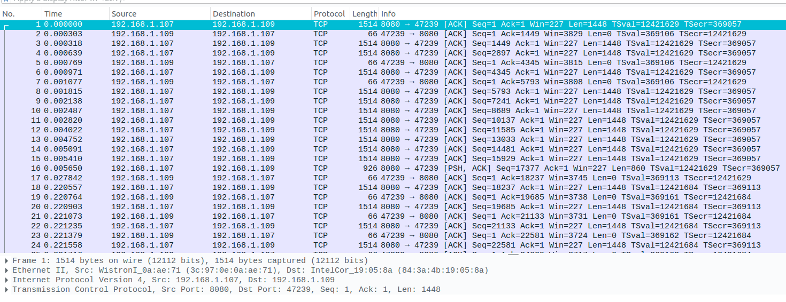
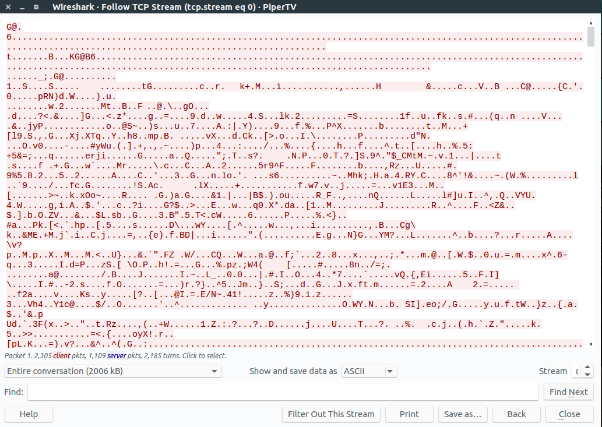

# Piper TV
```
Points: 159
Solves: 90
Category: Misc, Forensics
Description: Recently, a very interesting program has been broadcasted on Piper TV, have you watched it?

$ file PiperTV
PiperTV: tcpdump capture file (little-endian) - version 2.4 (Ethernet, capture length 262144)
```

## English
TODO

## Bahasa Indonesia
Buka file tersebut dengan Wireshark. Terdapat banyak traffic TCP.


Kita lakukan follow TCP stream agar lebih jelas, klik kanan pada frame pertama -> `Follow` -> `TCP Stream`.


Masih tidak jelas data apa yang dikirimkan. Kita coba simpan ke dalam file dan gunakan command `file` untuk mengetahui tipe file. Ubah settingan `Show and save data as` menjadi `Raw`, lalu pilih `Save as`.

```shell
$ file piper
tes.mpeg: MPEG transport stream data
```

File MPEG! Akan tetapi, jika kita tonton, video tersebut hanya berisi seekor burung lucu dan induknya. Apakah ada yang terlewat? Coba kita ekstrak semua frame dari video itu dengan `ffmpeg`.

```shell
$ mkdir frames

$ ffmpeg -i piper -filter:v fps=fps=30 frames/$frame%03d.jpg
```
Dan setelah melihat satu per satu frame, terdapat flag pada `frame384.jpg`.

Flag: `ASIS{41bb4b2455763d30b175a2c272ac5430}`
