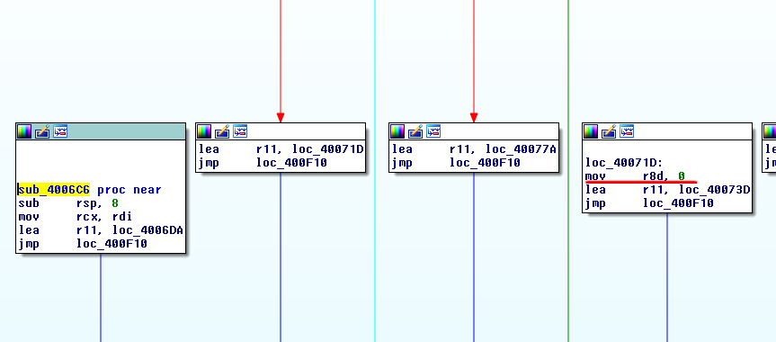
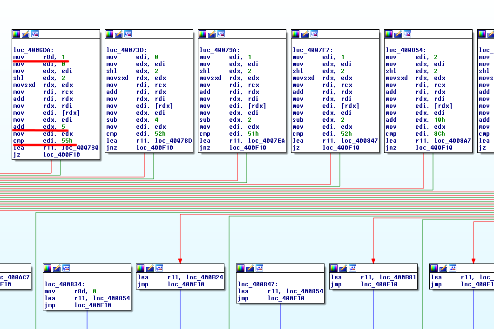
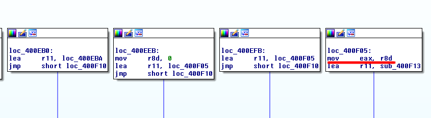

# no_mo_flo

| Category  | Points | Solves
| --------- | ------ | ------
| Reversing | 125    | 179

> Can you go with the flow?
>
> [Download](no_flo)

## Bahasa Indonesia

Decompile dengan IDA untuk melihat pseudocode.

```c
int main(__int64 a1, char **a2, char **a3) {
  v9 = read(0, buf, 0x20uLL);
  if ( v9 == 32 ) {
    for ( i = 0; i <= 15; ++i ) {
      v4[i] = buf[2 * i];
      v5[i] = buf[2 * i + 1];
    }
    sub_402C77(0LL, buf);
    v8 = sub_4006C6(v4);
    v7 = sub_400F18(v5);
    if ( v8 && v7 )
      puts("Good flow!!");
    else
      puts("You aint goin with the flow....");
    result = 0LL;
  } else {
    puts("Short input\n");
    result = 0xFFFFFFFFLL;
  }
  return result;
}
```

Program meminta input sepanjang 32 karakter, menyimpan karakter pada posisi genap (0, 2, ...) ke variabel `v4`, ganjil (1, 3, ...) ke variabel `v5`. Tujuan kita adalah membuat `sub_4006C6` dan `sub_400F18` bernilai `true`. Sederhana?

### Fungsi `sub_402C77`
Fungsi ini memasang trap untuk signal berkode `8`, [SIGFPE (Floating-point Exception)](http://man7.org/linux/man-pages/man7/signal.7.html), dan handlernya pada fungsi `sub_402B06`.
```c
int sub_402C77() {
  v3 = 4;
  v1 = sub_402B06;
  sigemptyset(&v2);
  return sigaction(8, &v1, 0LL);
}

int sub_402B06(__int64 a1, __int64 a2, __int64 a3) {
  if ( qword_603328 ) {
    v8 = *(a3 + 56);
    v7 = *(a3 + 176);
    v3 = *(a3 + 64);
    switch ( v3 ) {
      case 7LL:
        LODWORD(v3) = sub_402809(v8);
        break;
      case 1LL:
        LODWORD(v3) = sub_40281E(v8, v7);
        break;
      case 2LL:
        LODWORD(v3) = sub_40289A(v8, v7);
        break;
      case 3LL:
        LODWORD(v3) = sub_402937(v8, v7);
        break;
      case 4LL:
        LODWORD(v3) = sub_4029D4(v8, v7);
        break;
      case 5LL:
        LODWORD(v3) = sub_402A63(v8, v7);
        break;
      case 6LL:
        LODWORD(v3) = sub_402AB0(v8, v7);
        break;
      default:
        break;
    }
    qword_603320 = 1LL;
    qword_603328 = 0LL;
  } else {
    LODWORD(v3) = sigaction(8, 0LL, 0LL);
    if ( v3 < 0 ) {
      v4 = __errno_location();
      v5 = strerror(*v4);
      LODWORD(v3) = printf("sigaction install fail %s\n", v5);
    }
  }
  return v3;
}
```

### Fungsi `sub_4006C6`







Fungsi tersebut memiliki percabangan yang sangat banyak (hingga *graph*-nya tidak muat dalam layar). Akan tetapi, alurnya sebenarnya cukup mudah. Untuk lebih jelas, perhatikan juga gambar di atas yang telah digarisbawahi dengan warna merah.

1. Fungsi membuat register `r8d` bernilai `1`.
2. Mengecek semua karakter pada `v4` dengan sebelumnya dilakukan operasi berbeda-beda, seperti `add`,`sub`,`shl`, dll.
3. Lompat ke cabang tertentu berdasarkan hasil pengecekan di atas. Beberapa cabang membuat register `r8d` bernilai `0`.
4. Keluaran fungsi, `eax`, adalah nilai dari `r8d`.

Jelas bahwa tujuan kita di fungsi `sub_4006C6` adalah menghindari cabang yang membuat `r8d` menjadi `0`.

### Fungsi `sub_400F18`
Saya menggunakan `objdump` karena IDA tidak berhasil melakukan dekompilasi secara utuh.

```assembly
  400f18:	48 83 ec 08          	sub    $0x8,%rsp
> 400f1c:	be 01 00 00 00       	mov    $0x1,%esi
  400f21:	b8 00 00 00 00       	mov    $0x0,%eax
  400f26:	89 c2                	mov    %eax,%edx
  400f28:	c1 e2 02             	shl    $0x2,%edx
  400f2b:	48 63 d2             	movslq %edx,%rdx
  400f2e:	48 89 f8             	mov    %rdi,%rax
  400f31:	48 01 d0             	add    %rdx,%rax
  400f34:	48 89 c2             	mov    %rax,%rdx
  400f37:	8b 02                	mov    (%rdx),%eax
  400f39:	89 c2                	mov    %eax,%edx
> 400f3b:	83 ea 03             	sub    $0x3,%edx
  400f3e:	89 d0                	mov    %edx,%eax
> 400f40:	83 f8 40             	cmp    $0x40,%eax
  400f43:	4c 8d 14 25 28 10 40 	lea    0x401028,%r10
  400f4a:	00
  400f4b:	49 c7 c3 05 00 00 00 	mov    $0x5,%r11
  400f52:	c7 04 25 28 33 60 00 	movl   $0x1,0x603328
  400f59:	01 00 00 00
  400f5d:	48 89 04 25 30 33 60 	mov    %rax,0x603330
  400f64:	00
  400f65:	48 c7 c0 00 00 00 00 	mov    $0x0,%rax
  400f6c:	48 89 14 25 38 33 60 	mov    %rdx,0x603338
  400f73:	00
  400f74:	48 8d 15 00 00 00 00 	lea    0x0(%rip),%rdx #   400f7b
  400f7b:	48 89 14 25 48 33 60 	mov    %rdx,0x603348
  400f82:	00
  400f83:	99                   	cltd
> 400f84:	48 f7 3c 25 20 33 60 	idivq  0x603320
  400f8b:	00
  400f8c:	48 c7 04 25 20 33 60 	movq   $0x0,0x603320
  400f93:	00 00 00 00 00
  400f98:	48 8b 04 25 30 33 60 	mov    0x603330,%rax
  400f9f:	00
  400fa0:	48 8b 14 25 38 33 60 	mov    0x603338,%rdx
  400fa7:	00
  400fa8:	4c 8b 1c 25 40 33 60 	mov    0x603340,%r11
  400faf:	00
  400fb0:	41 ff e3             	jmpq   *%r11
> 400fb3:	be 00 00 00 00       	mov    $0x0,%esi
  400fb8:	4c 8d 14 25 28 10 40 	lea    0x401028,%r10
  ...
  4026f7:	99                   	cltd
  4026f8:	48 f7 3c 25 20 33 60 	idivq  0x603320
  4026ff:	00
  402700:	48 c7 04 25 20 33 60 	movq   $0x0,0x603320
  402707:	00 00 00 00 00
  40270c:	48 8b 04 25 30 33 60 	mov    0x603330,%rax
  402713:	00
  402714:	48 8b 14 25 38 33 60 	mov    0x603338,%rdx
  40271b:	00
  40271c:	4c 8b 1c 25 40 33 60 	mov    0x603340,%r11
  402723:	00
  402724:	41 ff e3             	jmpq   *%r11
> 402727:	89 f0                	mov    %esi,%eax
  402729:	48 83 c4 08          	add    $0x8,%rsp
  40272d:	c3                   	retq
```

Beberapa poin penting telah ditandai `>`. Fungsi tersebut kira-kira seperti ini:
  1. Membuat register `esi` bernilai `1`.
  2. Mengecek semua karakter pada `v5` dengan sebelumnya dilakukan operasi berbeda-beda, seperti `add`,`sub`,`shl`, dll.
  3. Melakukan *division by zero*, sehingga terjadi signal `SIGFPE` dan dihandle oleh fungsi `sub_402B06`. Handler tersebut lah yang menentukan lokasi percabangan selanjutnya. Beberapa lokasi percabangan membuat nilai `esi` menjadi `0`.
  4. Keluaran fungsi, `eax`, adalah nilai dari `esi`.

Hampir sama dengan fungsi sebelumnya, tujuan kita adalah menghindari cabang yang membuat `esi` menjadi `0`.

### Solusi
Untuk mendapatkan flag, bisa saja dilakukan secara manual, tapi akan memakan waktu. Beberapa cara dapat dilakukan untuk membuatnya otomatis, salah satunya (yang terpikir saat kontes berlangsung) adalah [debugging di gdb dengan python](https://sourceware.org/gdb/onlinedocs/gdb/Python-API.html#Python-API).

Pertama, kita cari address yang harus dihindari.

```shell
$ objdump -d no_flo | grep "0x0,%r8d"
  40071d:	41 b8 00 00 00 00    	mov    $0x0,%r8d
  ...
  400eeb:	41 b8 00 00 00 00    	mov    $0x0,%r8d

$ objdump -d no_flo | grep "0x0,%esi"
  400fb3:	be 00 00 00 00       	mov    $0x0,%esi
  ...
  402c20:	be 00 00 00 00       	mov    $0x0,%esi
```

Idenya adalah sebagai berikut (pisah antara karakter posisi genap dan ganjil):
  1. Pasang *breakpoint* pada semua cabang yang ingin dihindari.
  2. Lakukan *bruteforce* pada karakter indeks ke-i.
  3. Jalankan program dan cek posisi *program counter* (PC). Jika karakter tersebut salah, maka gdb akan berhenti pada breakpoint ke-i. Jika benar, maka gdb akan berhenti pada *breakpoint* ke-(i+1), lanjut ke karakter selanjutnya.

Berikut script python-nya.
```python
import gdb
import shlex
import string

avoid1 = [0x40071d, 0x40077a, 0x4007d7, 0x400834, 0x400894, 0x4008f4, 0x400950, 0x4009a8, 0x400a09, 0x400a6f, 0x400ac7, 0x400b24, 0x400b81, 0x400bd9, 0x400c31, 0x400c8e, 0x400ce6, 0x400d3e, 0x400d96, 0x400df2, 0x400e4a, 0x400ea0, 0x400eeb]
avoid2 = [0x400fb3, 0x4010ba, 0x4011bc, 0x4012be, 0x4013c6, 0x4014d4, 0x4015d6, 0x4016c0, 0x4017c2, 0x4018c4, 0x4019cd, 0x401ab7, 0x401bb9, 0x401cc5, 0x401db2, 0x401eba, 0x401fbc, 0x4020c2, 0x4021c4, 0x4022cb, 0x4023ba, 0x4024bc, 0x4025c3, 0x4026b2, 0x402c20]
avoid = avoid1 + avoid2 + [0x402727] # return from function (dummy breakpoint)

charset = "{}_?" + string.digits + string.ascii_letters
flag = [' '] * 32

def brute(i):
  global flag
  global last_breakpoint
  for c in charset:
    flag[i] = c
    output = gdb.execute('r < <(echo {})'.format(shlex.quote(''.join(flag))), True, True)
    # skip floating point exception
    while "SIGFPE" in output:
      output = gdb.execute('c', True, True)

    output = gdb.execute('x $pc', True, True)
    pc = output.split(":")[0]
    pc = int(pc, 16)
    if pc > last_breakpoint:
      last_breakpoint = pc
      break
  print(''.join(flag))

gdb.execute('file no_flo')

gdb.execute('delete breakpoints')
for a in avoid:
  gdb.execute('b *{}'.format(hex(a)))
last_breakpoint = avoid1[0]
for i in range(0, 32, 2):
  brute(i)

gdb.execute('delete breakpoints')
for a in avoid:
  gdb.execute('b *{}'.format(hex(a)))
last_breakpoint = avoid2[0]
for i in range(1, 32, 2):
  brute(i)

quit()
```

Jalankan dengan gdb, `$ gdb -x solve.py` dan didapatkanlah flag.

Flag: `PCTF{n0_fl0?_m0_like_ah_h3ll_n0}`
