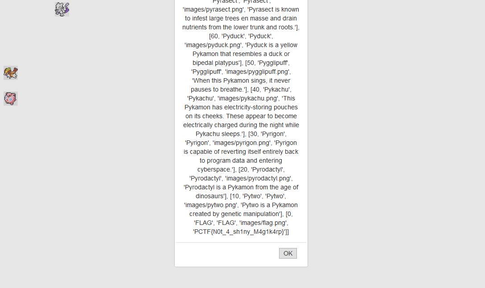

# Pykemon

| Category  | Points | Solves
| --------- | ------ | ------
| Web       | 151    | 201

> Gotta catch them [FLAG](http://pykemon.chal.pwning.xxx/)s!

> Take [this](pykemon_735afe812b9fd0f3fe16e3164aff5cdc.tar.bz2) with you.

## Bahasa Indonesia

Jika membaca source code `pykemon.py`, flag terletak di property `pykemon` pada kelas `Pykemon`. Nilai rarity-nya `0`, sehingga tidak mungkin didapatkan dengan cara biasa.

### Vulnerability

Jika membaca kode `run.py` dengan jeli, terdapat vulnerability pada baris:
```python
return "Successfully renamed to:\n" + new_name.format(p)
```
Dan dengan membaca dokumentasi python tentang [string format](https://docs.python.org/3/library/string.html#formatspec), kita bisa melihat atribut dari sebuah objek dengan sintaks `{0.attribute}`. `0` adalah argumen ke-0 dari fungsi format, dan `attribute` adalah atribut yang kita ingin akses.

### Solusi
Karena `p` adalah instance dari kelas `Pykemon`, kita bisa langsung mengakses atribut `pykemon`. Tangkap salah satu `pykemon`, lalu ubah namanya menjadi `{0.pykemon}`.



Flag: `PCTF{N0t_4_sh1ny_M4g1k4rp}`
