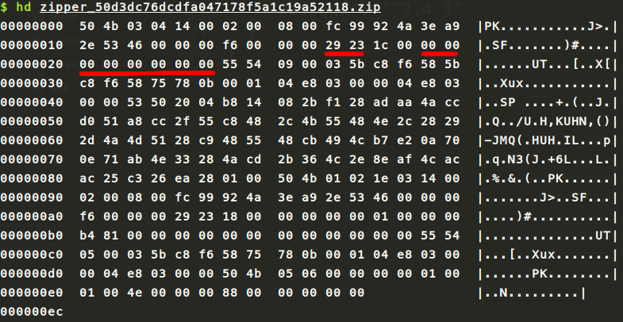
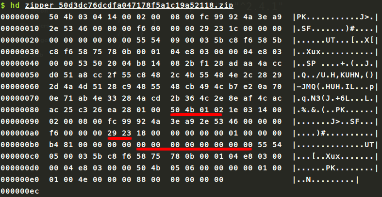
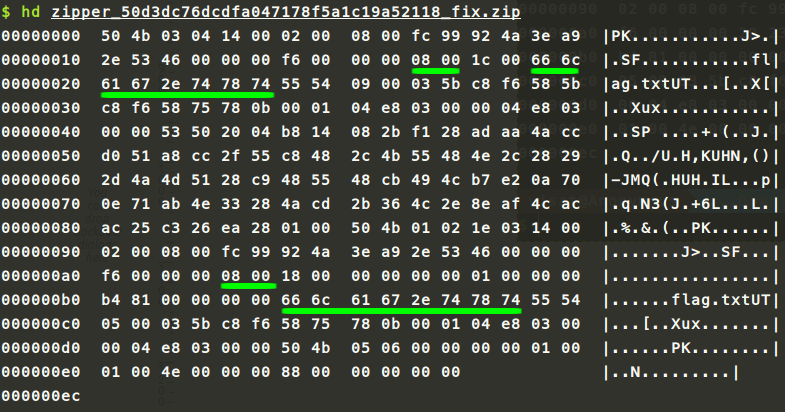

# Zipper

| Category  | Points | Solves
| --------- | ------ | ------
| Misc      | 50     | 335

> Something doesn't seem quite right with [this](zipper_50d3dc76dcdfa047178f5a1c19a52118.zip) zip file.

> Can you fix it and get the flag?

## Bahasa Indonesia

Coba kita lakukan `unzip`.
```shell
$ unzip zipper.zip
Archive:  z.zip
warning:  filename too long--truncating.
:  bad extra field length (central)
```

Coba kita lihat bagaimana [struktur file zip](https://en.wikipedia.org/wiki/Zip_%28file_format%29#File_headers). Panjang dari nama file, kita sebut `n`, terletak pada offset 26 sebesar 2 bytes dalam *little endian*, dan nama file terletak pada offset 30 sebesar `n` bytes.



Bisa dilihat bahwa pada *local file header*, nilai `n` telah diubah menjadi `0x2329` dan nama file dihilangkan. Kita dapat menebak bahwa `n` bernilai 8, dihitung dari banyaknya karakter yang diubah menjadi *null characters*.



Selain itu, pada *central directory file header* dengan *magic number* `0x02014b50`, nilai `n` pada offset 28 juga diubah. Nama file pada offset 46 pun dihilangkan.

### Solusi

Ubah nilai `n` menjadi 8, dan isi nama file dengan sesuatu sebanyak 8 karakter, misalnya `flag.txt`. Bisa dengan cara menggunakan hex editor ataupun tools lainnya.



Lalu lakukan unzip.

```shell
$ unzip zipper_50d3dc76dcdfa047178f5a1c19a52118_fix.zip
Archive:  zipper_50d3dc76dcdfa047178f5a1c19a52118_fix.zip
  inflating: flag.txt

$ cat flag.txt


Huzzah, you have captured the flag:
PCTF{f0rens1cs_yay}
```

Flag: `PCTF{f0rens1cs_yay}`
